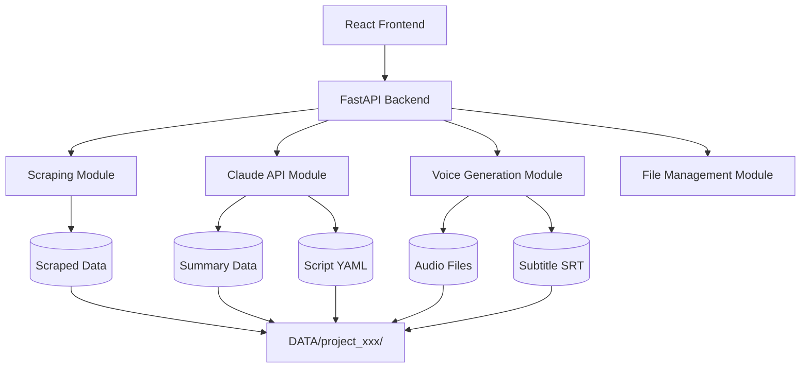

# URL動画台本生成システム - バックエンド処理フロー詳細説明

## 📋 目次
1. [システム全体アーキテクチャ](#システム全体アーキテクチャ)
2. [メイン処理フロー](#メイン処理フロー)
3. [各段階の詳細](#各段階の詳細)
4. [ファイル管理システム](#ファイル管理システム)
5. [進捗監視とステータス管理](#進捗監視とステータス管理)
6. [エラーハンドリング](#エラーハンドリング)
7. [APIエンドポイント](#apiエンドポイント)

## 🏗️ システム全体アーキテクチャ

このシステムは **FastAPI** をベースとしたRESTful APIとして構築されており、以下の主要コンポーネントから構成されています：



### 主要モジュール
- **`app/main.py`**: FastAPIアプリケーションのエントリーポイント
- **`app/api/project.py`**: プロジェクト管理API
- **`app/api/generation.py`**: 生成処理API
- **`app/modules/scraper.py`**: Webスクレイピング
- **`app/modules/summarizer.py`**: Claude API連携
- **`app/modules/script_generator.py`**: 台本生成
- **`app/modules/voice_generator.py`**: 音声生成（Nijivoice API）
- **`app/modules/subtitle_generator.py`**: 字幕生成
- **`app/modules/file_manager.py`**: ファイル管理

## 🚀 メイン処理フロー

### 1. プロジェクト作成 `/api/projects`
**機能**: 新しい動画制作プロジェクトを作成

**処理内容**:
- UUIDでプロジェクトIDを生成
- URLからタイトルを推定
- プロジェクトディレクトリ（`DATA/project_id/`）を作成
- プロジェクト情報をメモリストレージ（`projects_db`）に保存

### 2. フル処理実行 `/api/generate/process`
**バックグラウンドタスクとして以下の6段階を実行**：

```python
async def process_project_task(project_id: str, url: str, scenario_type: str, voice_actor_id: str = None):
    # 1. スクレイピング
    scraped_content = await scraper.scrape(url)
    await file_manager.save_file(project_id, "scraped_content.txt", scraped_content)
    
    # 2. 要約生成
    summary = await claude_client.summarize(scraped_content)
    await file_manager.save_file(project_id, "summary.txt", summary)
    
    # 3. 台本生成
    script = await script_generator.generate(summary, scenario_type)
    await file_manager.save_file(project_id, "script.yaml", script)
    
    # 4. 音声生成用プロンプト作成
    voice_prompt = voice_generator.create_voice_prompt(script, voice_actor_id)
    await file_manager.save_file(project_id, "voice_prompt.yaml", voice_prompt)
    
    # 5. 音声生成
    audio_data = await voice_generator.generate_from_script(voice_prompt)
    await file_manager.save_file(project_id, "audio.wav", audio_data)
    
    # 6. 字幕生成
    subtitle = subtitle_generator.generate_srt(script)
    await file_manager.save_file(project_id, "subtitle.srt", subtitle)
```

## 📋 各段階の詳細

### 📖 段階1: Webスクレイピング (`scraper.py`)

**機能**: 指定されたURLからコンテンツを取得

**技術仕様**:
- **静的サイト**: `requests` + `BeautifulSoup` でコンテンツ取得
- **動的サイト**: `Selenium` + `Chrome` でJavaScript実行後のコンテンツ取得
- **自動フォールバック**: 静的スクレイピング失敗時は自動的にSeleniumで再試行
- **テキスト整形**: HTMLタグ除去、空白行整理、不要要素削除

**出力**: `scraped_content.txt`

### 🤖 段階2: AI要約生成 (`summarizer.py`)

**機能**: スクレイピング内容をAIで要約

**技術仕様**:
- **Claude API**を使用してコンテンツを要約
- **プロンプト**: 動画制作に適した情報を中心に500文字以内で要約
- **フォールバック**: API利用不可時は元テキストの最初の500文字を使用

**出力**: `summary.txt`

### 📝 段階3: 台本生成 (`script_generator.py`)

**機能**: シナリオテンプレートに基づいた台本生成

**利用可能テンプレート**:
- `product_introduction`: 製品紹介
- `tutorial`: 使い方説明  
- `feature_explanation`: 機能説明

**技術仕様**:
- **Claude API**で自然な台本テキストを生成
- **構造化データ**: YAML形式でシーン情報、音声設定を含む
- **時間計算**: 目標時間に合わせたシーン配分

**出力**: `script.yaml` (シーン情報、音声設定含む)

### 🎵 段階4: 音声生成プロンプト作成

**機能**: 台本から音声API用のパラメータを作成

**技術仕様**:
- 台本から**Nijivoice API**用のパラメータを作成
- **音声設定**: speed, volume, pitch, pauseLength等を文字列として設定
- **セグメント分割**: シーンごとに音声生成パラメータを準備

**出力**: `voice_prompt.yaml`

### 🔊 段階5: 音声ファイル生成 (`voice_generator.py`)

**機能**: 音声合成API連携

**技術仕様**:
- **Nijivoice API**を使用した音声合成
- **複数セグメント対応**: シーンごとに音声生成して結合
- **ボイスアクター選択**: 指定なし時は利用可能な最初のアクターを使用
- **パラメータ**: speed, volume, pitch, pauseLength, intonation

**出力**: `audio.wav`

### 📺 段階6: 字幕ファイル生成 (`subtitle_generator.py`)

**機能**: 台本から字幕ファイルを生成

**技術仕様**:
- **SRT形式**: 動画プレイヤー標準の字幕形式
- **WebVTT形式**: ブラウザ標準の字幕形式
- **タイムスタンプ計算**: シーンのdurationから自動計算
- **時間形式**: `HH:MM:SS,mmm` (SRT) / `HH:MM:SS.mmm` (WebVTT)

**出力**: `subtitle.srt`, `subtitle.vtt`

## 📁 ファイル管理システム (`file_manager.py`)

### データ保存構造
```
DATA/
└── {project_id}/
    ├── scraped_content.txt    # スクレイピング結果
    ├── summary.txt            # AI要約
    ├── script.yaml           # 構造化台本
    ├── voice_prompt.yaml     # 音声生成パラメータ
    ├── audio.wav             # 生成音声
    ├── subtitle.srt          # SRT字幕
    ├── subtitle.vtt          # WebVTT字幕
    └── error.json            # エラー情報（失敗時）
```

### ファイル形式対応
- **YAML**: 構造化データ（台本、音声設定）
- **JSON**: メタデータ、エラー情報
- **テキスト**: プレーンテキスト（要約、スクレイピング結果）
- **バイナリ**: 音声ファイル、画像等

### 主要メソッド
- `create_project_dir()`: プロジェクトディレクトリ作成
- `save_file()`: ファイル保存（形式自動判定）
- `read_file()`: ファイル読み込み（形式自動判定）
- `list_project_files()`: プロジェクトファイル一覧

## 🔄 進捗監視とステータス管理

### ステータス種類
- `created`: プロジェクト作成完了
- `processing`: 処理実行中
- `completed`: 全工程完了
- `failed`: エラーで処理中断

### 進捗計算 (`_calculate_progress`)
```python
required_files = [
    "scraped_content.txt",    # スクレイピング
    "summary.txt",            # 要約生成  
    "script.yaml",            # 台本生成
    "voice_prompt.yaml",      # 音声プロンプト作成
    "audio.wav",              # 音声生成
    "subtitle.srt"            # 字幕生成
]
```

**進捗計算方法**: 
完了ファイル数 / 総ステップ数 × 100

**リアルタイム監視**: 
`/api/projects/{id}/status` エンドポイントで進捗確認可能

## 🛡️ エラーハンドリング

### エラー対応戦略
- **段階的フォールバック**: 各処理で代替手段を提供
- **詳細ログ記録**: 各段階の実行状況をログ出力
- **エラーファイル保存**: 失敗時は`error.json`にエラー詳細を記録
- **ステータス更新**: エラー時は自動的に`failed`ステータスに変更

### API利用時の考慮事項
- **Claude API**: キー未設定時は要約スキップ（元テキストの先頭を使用）
- **Nijivoice API**: キー未設定時はモックデータを返却
- **レート制限**: 各APIの利用制限内で動作
- **タイムアウト**: 各処理で適切なタイムアウト設定

### エラーコード
```python
ERROR_CODES = {
    "E001": "Invalid URL",
    "E002": "Scraping failed", 
    "E003": "Claude API error",
    "E004": "Voice generation failed",
    "E005": "File save error",
    "E006": "Project not found"
}
```

## 🌐 APIエンドポイント

### プロジェクト管理
| メソッド | エンドポイント | 説明 |
|---------|---------------|------|
| POST | `/api/projects` | プロジェクト作成 |
| GET | `/api/projects/{id}` | プロジェクト詳細取得 |
| GET | `/api/projects/{id}/status` | 処理状況確認 |
| GET | `/api/projects/` | プロジェクト一覧取得 |
| DELETE | `/api/projects/{id}` | プロジェクト削除 |

### 生成処理
| メソッド | エンドポイント | 説明 |
|---------|---------------|------|
| POST | `/api/generate/process` | フル処理実行 |
| POST | `/api/generate/scrape` | スクレイピングのみ |
| POST | `/api/generate/summary` | 要約生成のみ |
| POST | `/api/generate/script` | 台本生成のみ |
| POST | `/api/generate/voice` | 音声生成のみ |
| POST | `/api/generate/subtitle` | 字幕生成のみ |
| GET | `/api/generate/voice-actors` | ボイスアクター一覧 |
| GET | `/api/generate/scenarios` | シナリオテンプレート一覧 |
| GET | `/api/generate/download/{project_id}/{file_type}` | ファイルダウンロード |

### リクエスト例

#### プロジェクト作成
```json
POST /api/projects
{
  "url": "https://example.com/product",
  "scenario_type": "product_introduction",
  "options": {
    "target_duration": 60,
    "voice_type": "female_young"
  }
}
```

#### フル処理実行
```http
POST /api/generate/process?project_id=550e8400-e29b-41d4-a716-446655440000&voice_actor_id=voice-001
```

## 🔧 技術スタック

### バックエンド
- **FastAPI**: 高性能非同期Webフレームワーク
- **Python 3.9+**: メイン開発言語
- **aiofiles**: 非同期ファイル操作
- **aiohttp**: 非同期HTTP通信
- **requests**: 同期HTTP通信
- **BeautifulSoup4**: HTMLパース
- **Selenium**: ブラウザ自動化
- **PyYAML**: YAML処理
- **anthropic**: Claude API公式SDK

### 外部API
- **Claude API**: AI要約・台本生成
- **Nijivoice API**: 音声合成

### ストレージ
- **ファイルシステム**: プロジェクトデータ保存
- **メモリ**: プロジェクト情報一時保存（実際の運用ではDBを推奨）

## 🚀 デプロイ情報

### 起動方法
```bash
# 開発環境
cd backend
uvicorn app.main:app --reload --port 8080

# 本番環境
uvicorn app.main:app --host 0.0.0.0 --port 8080
```

### 環境変数
```bash
CLAUDE_API_KEY=your_claude_api_key
NIJIVOICE_API_KEY=your_nijivoice_api_key
DATA_DIR=../DATA
BACKEND_PORT=8080
```

---

このシステムは**モジュラー設計**で各機能が独立しており、段階的な処理実行と詳細な進捗監視、堅牢なエラーハンドリングを提供しています。各モジュールは独立してテスト・デバッグが可能で、APIキーが設定されていない場合もフォールバック機能により動作を継続できます。