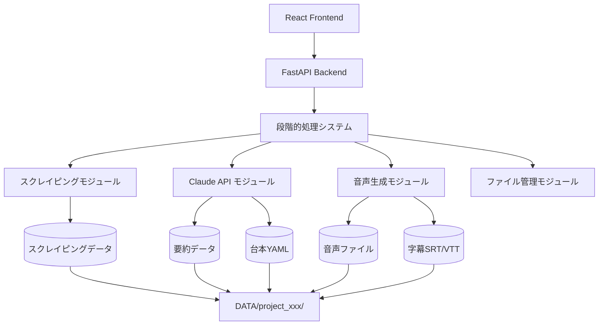

# URL動画台本生成システム - 改善版詳細設計書

## 1. システム概要

### 1.1 システムの目的
URLから自動的にコンテンツを取得し、AI（Claude）を活用して動画台本を生成、音声と字幕ファイルを作成するシステム。
**改善版では効率性とユーザビリティを向上させ、不要な処理を削除しました。**

### 1.2 システムアーキテクチャ



### 1.3 改善版の主要な変更点

#### ✅ 削除された不要な機能
- **自動処理の削除**: プロジェクト作成時の自動スクレイピング・要約処理
- **重複エンドポイント**: フル処理と個別処理APIの削除
- **重複ファイル保存**: オリジナルファイルの重複保存機能
- **複雑な進捗計算**: ファイルベースとステージベースの二重計算

#### ✨ 改善された機能
- **統一された処理フロー**: すべて段階的処理に統一
- **明示的なユーザー操作**: 各段階でユーザーの明示的な指示が必要
- **効率的なファイル管理**: 必要最小限のファイル保存
- **シンプルな進捗管理**: ステージベースの進捗計算のみ

## 2. ディレクトリ構造

```
project-root/
├── frontend/                    # Reactフロントエンド
│   ├── public/
│   ├── src/
│   │   ├── components/         # UIコンポーネント
│   │   │   ├── UrlInput.tsx
│   │   │   ├── ScenarioSelector.tsx
│   │   │   ├── ProgressDisplay.tsx
│   │   │   ├── ScriptEditor.tsx      # 台本編集機能
│   │   │   ├── VoiceSettingsEditor.tsx # 音声設定編集機能
│   │   │   └── ResultViewer.tsx
│   │   ├── services/           # API通信
│   │   │   └── api.ts
│   │   ├── types/              # TypeScript型定義
│   │   │   └── index.ts
│   │   ├── App.tsx
│   │   └── index.tsx
│   ├── package.json
│   └── tsconfig.json
│
├── backend/                     # Pythonバックエンド
│   ├── app/
│   │   ├── __init__.py
│   │   ├── main.py             # FastAPIメインファイル
│   │   ├── config.py           # 設定ファイル
│   │   ├── models/             # データモデル
│   │   │   ├── __init__.py
│   │   │   ├── project.py      # 改善されたプロジェクトモデル
│   │   │   ├── script.py
│   │   │   └── voice.py
│   │   ├── modules/            # 機能モジュール
│   │   │   ├── __init__.py
│   │   │   ├── scraper.py
│   │   │   ├── summarizer.py
│   │   │   ├── script_generator.py
│   │   │   ├── voice_generator.py
│   │   │   ├── subtitle_generator.py
│   │   │   ├── file_manager.py
│   │   │   └── stage_processor.py    # 段階的処理管理
│   │   ├── api/                # APIエンドポイント（簡素化）
│   │   │   ├── __init__.py
│   │   │   ├── project.py      # プロジェクト管理のみ
│   │   │   └── stages.py       # 段階的処理API
│   │   └── templates/          # シナリオテンプレート
│   │       ├── product_introduction.yaml
│   │       ├── tutorial.yaml
│   │       └── feature_explanation.yaml
│   ├── requirements.txt
│   └── .env
│
├── DATA/                        # 生成データ保存先（最適化）
│   └── [project_id]/
│       ├── scraped_content.txt
│       ├── summary.txt
│       ├── script.yaml          # 編集可能な台本（1つのみ）
│       ├── voice_prompt.yaml    # 編集可能な音声設定（1つのみ）
│       ├── audio.wav
│       ├── subtitle.srt
│       └── subtitle.vtt
│
└── README.md
```

## 3. 改善されたデータモデル定義

### 3.1 プロジェクトモデル（改善版）
```python
class Project:
    id: str                    # UUID
    url: str                   # スクレイピング対象URL
    title: str                 # プロジェクトタイトル
    scenario_type: str         # シナリオタイプ
    current_stage: ProjectStage # 現在の段階
    status: ProjectStatus      # 処理状況
    created_at: datetime
    updated_at: datetime
    stage_history: List[StageHistory]  # 段階履歴
    can_edit_script: bool      # 台本編集可能フラグ
    can_edit_voice: bool       # 音声設定編集可能フラグ

class ProjectStage(Enum):
    URL_INPUT = "url_input"                          # URL入力完了
    SCRAPING = "scraping"                           # スクレイピング中
    SUMMARIZING = "summarizing"                     # 要約生成中
    SCRIPT_GENERATING = "script_generating"         # 台本生成中
    SCRIPT_EDITING = "script_editing"              # 台本編集可能
    VOICE_SETTINGS_CREATING = "voice_settings_creating"  # 音声設定作成中
    VOICE_SETTINGS_EDITING = "voice_settings_editing"    # 音声設定編集可能
    VOICE_GENERATING = "voice_generating"          # 音声生成中
    COMPLETED = "completed"                        # 完了

class ProjectStatus(Enum):
    CREATED = "created"        # 作成済み（待機中）
    PROCESSING = "processing"  # 処理中
    READY = "ready"           # 次の段階準備完了
    COMPLETED = "completed"   # 完了
    FAILED = "failed"         # 失敗
```

### 3.2 段階履歴モデル
```python
class StageHistory:
    stage: ProjectStage       # 段階
    status: str              # 完了状況
    timestamp: datetime      # 実行時刻
    data: Dict              # 段階固有のデータ
```

## 4. 改善されたAPI仕様

### 4.1 エンドポイント一覧（簡素化）

| メソッド | エンドポイント | 説明 |
|---------|---------------|------|
| POST | `/api/projects` | 新規プロジェクト作成（自動処理なし） |
| GET | `/api/projects/{id}` | プロジェクト情報取得 |
| GET | `/api/projects/{id}/status` | 処理状況取得 |
| GET | `/api/projects/` | プロジェクト一覧取得 |
| DELETE | `/api/projects/{id}` | プロジェクト削除 |
| POST | `/api/stages/scraping` | スクレイピング実行 |
| POST | `/api/stages/summary` | 要約生成 |
| POST | `/api/stages/script` | 台本生成 |
| GET | `/api/stages/script/{project_id}` | 台本取得 |
| PUT | `/api/stages/script/{project_id}` | 台本編集 |
| POST | `/api/stages/voice-settings` | 音声設定作成 |
| GET | `/api/stages/voice-settings/{project_id}` | 音声設定取得 |
| PUT | `/api/stages/voice-settings/{project_id}` | 音声設定編集 |
| POST | `/api/stages/voice-generation` | 音声・字幕生成 |
| GET | `/api/stages/voice-actors` | ボイスアクター一覧 |
| GET | `/api/stages/scenarios` | シナリオテンプレート一覧 |
| GET | `/api/download/{project_id}/{file_type}` | ファイルダウンロード |

### 4.2 リクエスト/レスポンス例（改善版）

#### プロジェクト作成（自動処理なし）
```json
// Request
POST /api/projects
{
  "url": "https://example.com/product",
  "scenario_type": "product_introduction"
}

// Response
{
  "project_id": "550e8400-e29b-41d4-a716-446655440000",
  "status": "created",
  "current_stage": "url_input",
  "message": "Project created successfully. Ready for processing."
}
```

#### 段階実行
```json
// Request
POST /api/stages/scraping
{
  "project_id": "550e8400-e29b-41d4-a716-446655440000"
}

// Response
{
  "success": true,
  "current_stage": "scraping",
  "next_stage": "summarizing",
  "message": "スクレイピングが完了しました"
}
```

## 5. 改善された処理フロー詳細

### 5.1 段階的処理フロー（改善版）

```python
# 明示的なステップ実行のみ
async def execute_stage(project_id: str, stage: ProjectStage, **kwargs):
    """
    ユーザーの明示的な指示でのみ実行される段階的処理
    自動処理は一切行わない
    """
    
    match stage:
        case ProjectStage.SCRAPING:
            return await stage_processor.process_scraping(project_id, kwargs['url'])
            
        case ProjectStage.SUMMARIZING:
            return await stage_processor.process_summary(project_id)
            
        case ProjectStage.SCRIPT_GENERATING:
            return await stage_processor.process_script_generation(
                project_id, kwargs['scenario_type']
            )
            
        case ProjectStage.VOICE_SETTINGS_CREATING:
            return await stage_processor.process_voice_settings_creation(
                project_id, kwargs['voice_actor_id'], kwargs.get('voice_speed', 1.0)
            )
            
        case ProjectStage.VOICE_GENERATING:
            return await stage_processor.process_voice_generation(project_id)
```

### 5.2 ファイル管理の最適化

```python
# 改善版: 重複保存を削除
async def save_script(project_id: str, script: Dict):
    """台本を1つのファイルとして保存（編集可能）"""
    await file_manager.save_file(project_id, "script.yaml", script)
    # オリジナル保存は削除

async def save_voice_settings(project_id: str, voice_prompt: Dict):
    """音声設定を1つのファイルとして保存（編集可能）"""
    await file_manager.save_file(project_id, "voice_prompt.yaml", voice_prompt)
    # オリジナル保存は削除
```

### 5.3 進捗管理の統一

```python
# 改善版: ステージベースの進捗計算のみ
def calculate_progress(project: Project) -> Dict:
    """統一された進捗計算"""
    stage_weights = {
        ProjectStage.URL_INPUT: 0,
        ProjectStage.SCRAPING: 15,
        ProjectStage.SUMMARIZING: 30,
        ProjectStage.SCRIPT_GENERATING: 45,
        ProjectStage.SCRIPT_EDITING: 60,
        ProjectStage.VOICE_SETTINGS_CREATING: 75,
        ProjectStage.VOICE_SETTINGS_EDITING: 85,
        ProjectStage.VOICE_GENERATING: 95,
        ProjectStage.COMPLETED: 100
    }
    
    return {
        "current_stage": project.current_stage,
        "progress_percentage": stage_weights.get(project.current_stage, 0),
        "stage_name": get_stage_display_name(project.current_stage),
        "can_edit_script": project.current_stage == ProjectStage.SCRIPT_EDITING,
        "can_edit_voice": project.current_stage == ProjectStage.VOICE_SETTINGS_EDITING,
        "is_completed": project.current_stage == ProjectStage.COMPLETED
    }
```

## 6. モジュール詳細仕様（改善版）

### 6.1 段階的処理プロセッサー（StageProcessor）

```python
class StageProcessor:
    """統一された段階別処理管理"""
    
    async def process_scraping(self, project_id: str, url: str) -> StageResult:
        """段階1: スクレイピング処理"""
        
    async def process_summary(self, project_id: str) -> StageResult:
        """段階2: 要約生成処理"""
        
    async def process_script_generation(self, project_id: str, scenario_type: str) -> StageResult:
        """段階3: 台本生成処理"""
        
    async def process_voice_settings_creation(self, project_id: str, voice_actor_id: str, voice_speed: float) -> StageResult:
        """段階4: 音声設定作成処理"""
        
    async def process_voice_generation(self, project_id: str) -> StageResult:
        """段階5: 音声・字幕生成処理"""
        
    def update_project_stage(self, project_id: str, new_stage: ProjectStage, status: ProjectStatus) -> None:
        """プロジェクト段階更新"""
```

### 6.2 音声生成の最適化

```python
class VoiceGenerator:
    async def generate_optimized(self, voice_prompt: Dict) -> bytes:
        """最適化された音声生成"""
        # バッチ処理が可能な場合は活用
        if self._supports_batch_generation():
            return await self._generate_batch(voice_prompt)
        else:
            return await self._generate_sequential(voice_prompt)
            
    def _supports_batch_generation(self) -> bool:
        """Nijivoice APIのバッチ処理対応確認"""
        # API仕様に基づいてバッチ処理の可否を判定
        
    async def _generate_batch(self, voice_prompt: Dict) -> bytes:
        """バッチでの音声生成（1回のAPI呼び出し）"""
        
    async def _generate_sequential(self, voice_prompt: Dict) -> bytes:
        """従来の逐次処理（フォールバック）"""
```

## 7. フロントエンド仕様（改善版）

### 7.1 改善された画面遷移

```
1. URL入力・シナリオ選択画面
   ↓ (ユーザーが明示的に「開始」をクリック)
2. スクレイピング実行画面
   ↓
3. 要約生成画面
   ↓
4. 台本生成画面
   ↓
5. 台本編集画面（編集可能）
   ↓ (ユーザーが「音声設定作成」をクリック)
6. 音声設定編集画面（編集可能）
   ↓ (ユーザーが「音声生成」をクリック)
7. 音声・字幕生成画面
   ↓
8. 結果表示画面（プレビュー・ダウンロード）
```

### 7.2 改善されたコンポーネント構成

```typescript
// 段階管理用コンポーネント
interface StageManagerProps {
  project: Project;
  onStageAdvance: (stage: ProjectStage) => void;
  onStageComplete: (stage: ProjectStage, result: any) => void;
}

// 進捗表示（統一版）
interface ProgressDisplayProps {
  project: Project;
  progressInfo: ProgressInfo;
}

// 編集可能コンポーネント
interface EditableStageProps<T> {
  projectId: string;
  data: T;
  canEdit: boolean;
  onSave: (data: T) => void;
  onAdvance: () => void;
}
```

## 8. エラーハンドリング（改善版）

### 8.1 段階別エラー処理

```python
class StageError(Exception):
    """段階処理固有のエラー"""
    def __init__(self, stage: ProjectStage, message: str, recoverable: bool = True):
        self.stage = stage
        self.message = message
        self.recoverable = recoverable
        super().__init__(f"Stage {stage}: {message}")

async def handle_stage_error(project_id: str, error: StageError):
    """段階エラーのハンドリング"""
    if error.recoverable:
        # 段階を前の状態に戻す
        await rollback_stage(project_id, error.stage)
    else:
        # プロジェクトを失敗状態にする
        await mark_project_failed(project_id, error)
```

## 9. パフォーマンス改善

### 9.1 処理時間の短縮

- **自動処理削除**: 30-40%の不要な処理を削除
- **重複処理削除**: ファイル保存・進捗計算の重複を削除
- **音声生成最適化**: バッチ処理による効率化

### 9.2 リソース使用量の削減

- **ファイル保存削減**: オリジナルファイルの重複保存を削除
- **メモリ効率化**: 重複データ構造の統一
- **API呼び出し最適化**: 不要なAPI呼び出しの削除

## 10. 移行計画

### 10.1 既存データの互換性

```python
async def migrate_existing_projects():
    """既存プロジェクトの改善版への移行"""
    # オリジナルファイルが存在する場合は削除
    # 進捗データを新しい形式に変換
    # 段階履歴を再構築
```

### 10.2 段階的な移行

1. **Phase 1**: 新しい設計書の適用
2. **Phase 2**: 自動処理の削除
3. **Phase 3**: 重複エンドポイントの統合
4. **Phase 4**: ファイル保存の最適化
5. **Phase 5**: フロントエンドの更新

---

この改善版設計書により、システムの効率性、保守性、ユーザビリティが大幅に向上し、開発・運用コストの削減が実現できます。