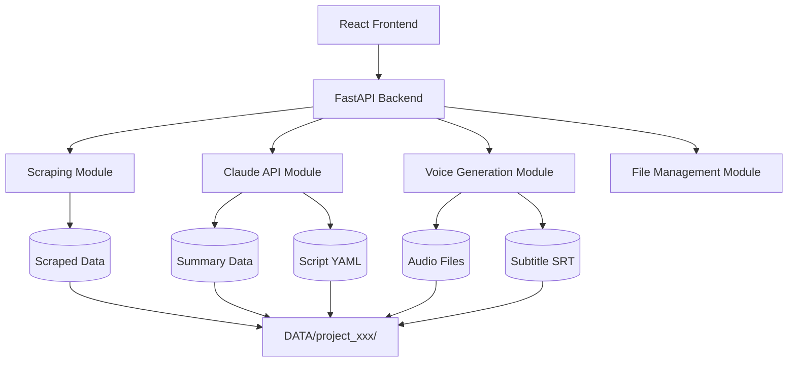

# URL動画台本生成システム - 詳細設計書

## 1. システム概要

### 1.1 システムの目的
URLから自動的にコンテンツを取得し、AI（Claude）を活用して動画台本を生成、音声と字幕ファイルを作成するシステム。

### 1.2 システムアーキテクチャ



## 2. ディレクトリ構造

```
project-root/
├── frontend/                    # Reactフロントエンド
│   ├── public/
│   ├── src/
│   │   ├── components/         # UIコンポーネント
│   │   │   ├── UrlInput.tsx
│   │   │   ├── ScenarioSelector.tsx
│   │   │   ├── ProgressDisplay.tsx
│   │   │   └── ResultViewer.tsx
│   │   ├── services/           # API通信
│   │   │   └── api.ts
│   │   ├── types/              # TypeScript型定義
│   │   │   └── index.ts
│   │   ├── App.tsx
│   │   └── index.tsx
│   ├── package.json
│   └── tsconfig.json
│
├── backend/                     # Pythonバックエンド
│   ├── app/
│   │   ├── __init__.py
│   │   ├── main.py             # FastAPIメインファイル
│   │   ├── config.py           # 設定ファイル
│   │   ├── models/             # データモデル
│   │   │   ├── __init__.py
│   │   │   ├── project.py
│   │   │   ├── script.py
│   │   │   └── voice.py
│   │   ├── modules/            # 機能モジュール
│   │   │   ├── __init__.py
│   │   │   ├── scraper.py
│   │   │   ├── summarizer.py
│   │   │   ├── script_generator.py
│   │   │   ├── voice_generator.py
│   │   │   ├── subtitle_generator.py
│   │   │   └── file_manager.py
│   │   ├── api/                # APIエンドポイント
│   │   │   ├── __init__.py
│   │   │   ├── project.py
│   │   │   └── generation.py
│   │   └── templates/          # シナリオテンプレート
│   │       ├── product_introduction.yaml
│   │       ├── tutorial.yaml
│   │       └── feature_explanation.yaml
│   ├── requirements.txt
│   └── .env
│
├── DATA/                        # 生成データ保存先
│   └── [project_id]/
│       ├── scraped_content.txt
│       ├── summary.txt
│       ├── script.yaml
│       ├── voice_prompt.yaml
│       ├── audio.wav
│       └── subtitle.srt
│
└── README.md
```

## 3. データモデル定義

### 3.1 プロジェクトモデル
```python
class Project:
    id: str                    # UUID
    url: str                   # スクレイピング対象URL
    title: str                 # プロジェクトタイトル
    scenario_type: str         # シナリオタイプ
    status: str               # processing, completed, failed
    created_at: datetime
    updated_at: datetime
```

### 3.2 スクリプトモデル (YAML)
```yaml
# script.yaml
metadata:
  project_id: "uuid-xxxx-xxxx"
  title: "動画タイトル"
  scenario_type: "product_introduction"
  total_duration: 60  # 秒
  created_at: "2024-01-01T12:00:00"

scenes:
  - scene_id: 1
    scene_type: "opening"
    duration: 5.0
    text: "こんにちは！今日は素晴らしい製品をご紹介します"
    voice_settings:
      emotion: "cheerful"
      speed: 1.0
      pitch: 1.0
    
  - scene_id: 2
    scene_type: "main_content"
    duration: 10.0
    text: "この製品には3つの革新的な特徴があります"
    voice_settings:
      emotion: "confident"
      speed: 0.95
      pitch: 1.0
```

### 3.3 音声生成用モデル (YAML)
```yaml
# voice_prompt.yaml
api_settings:
  service: "nijivoice"
  voice_actor_id: "7c16f2ab-2e4b-43dd-9c0e-818de7de1e02"  # 実際のIDに置き換え
  output_format: "wav"

segments:
  - segment_id: 1
    text: "こんにちは！今日は素晴らしい製品をご紹介します"
    start_time: 0.0
    end_time: 5.0
    parameters:
      speed: 1.0
      volume: 1.0
      pitch: 0
      pauseLength: 0.8
      pauseLengthSentence: 1.0
      intonation: 1.0
```

### 3.4 字幕モデル (SRT)
```srt
1
00:00:00,000 --> 00:00:05,000
こんにちは！今日は素晴らしい製品をご紹介します

2
00:00:05,500 --> 00:00:15,500
この製品には3つの革新的な特徴があります
```

## 4. API仕様

### 4.1 エンドポイント一覧

| メソッド | エンドポイント | 説明 |
|---------|---------------|------|
| POST | /api/projects | 新規プロジェクト作成 |
| GET | /api/projects/{id} | プロジェクト情報取得 |
| GET | /api/projects/{id}/status | 処理状況取得 |
| GET | /api/scenarios | シナリオテンプレート一覧 |
| POST | /api/generate/scrape | スクレイピング実行 |
| POST | /api/generate/summary | 要約生成 |
| POST | /api/generate/script | 台本生成 |
| POST | /api/generate/voice | 音声生成 |
| POST | /api/generate/subtitle | 字幕生成 |
| GET | /api/generate/voice-actors | ボイスアクター一覧取得 |
| GET | /api/download/{project_id}/{file_type} | ファイルダウンロード |

### 4.2 リクエスト/レスポンス例

#### プロジェクト作成
```json
// Request
POST /api/projects
{
  "url": "https://example.com/product",
  "scenario_type": "product_introduction",
  "options": {
    "target_duration": 60,
    "voice_type": "female_young"
  }
}

// Response
{
  "project_id": "550e8400-e29b-41d4-a716-446655440000",
  "status": "created",
  "message": "Project created successfully"
}
```

## 5. 処理フロー詳細

### 5.1 メイン処理フロー
```python
async def process_project(project_id: str, url: str, scenario_type: str):
    # 1. スクレイピング
    scraped_content = await scrape_website(url)
    await save_file(project_id, "scraped_content.txt", scraped_content)
    
    # 2. 要約生成
    summary = await generate_summary(scraped_content)
    await save_file(project_id, "summary.txt", summary)
    
    # 3. 台本生成
    script = await generate_script(summary, scenario_type)
    await save_file(project_id, "script.yaml", script)
    
    # 4. 音声生成用プロンプト作成
    voice_prompt = await create_voice_prompt(script)
    await save_file(project_id, "voice_prompt.yaml", voice_prompt)
    
    # 5. 音声生成
    audio_file = await generate_voice(voice_prompt)
    await save_file(project_id, "audio.wav", audio_file)
    
    # 6. 字幕生成
    subtitle = await generate_subtitle(script, audio_file)
    await save_file(project_id, "subtitle.srt", subtitle)
```

## 6. モジュール詳細仕様

### 6.1 スクレイピングモジュール
```python
class Scraper:
    def __init__(self):
        self.session = requests.Session()
        self.driver = None  # Selenium用
    
    async def scrape(self, url: str) -> str:
        """
        URLからコンテンツを取得
        - 静的サイト: BeautifulSoup使用
        - 動的サイト: Selenium使用
        - テキスト抽出と整形
        """
```

### 6.2 Claude API連携モジュール
```python
class ClaudeClient:
    def __init__(self, api_key: str):
        self.client = anthropic.Client(api_key)
    
    async def summarize(self, content: str, max_length: int = 500) -> str:
        """コンテンツを要約"""
        
    async def generate_script(
        self, 
        summary: str, 
        scenario_template: dict,
        target_duration: int
    ) -> dict:
        """台本生成"""
```

### 6.3 音声生成モジュール
```python
class VoiceGenerator:
    def __init__(self, api_key: str):
        self.api_key = api_key
        self.base_url = "https://api.nijivoice.com/api/platform/v1"
    
    async def get_voice_actors(self) -> list:
        """利用可能なボイスアクター一覧を取得"""
        
    async def generate(self, voice_actor_id: str, text: str, options: dict = None) -> bytes:
        """
        音声ファイル生成
        Parameters:
            voice_actor_id: ボイスアクターのID
            text: 生成するテキスト
            options: 追加パラメータ（speed, volume, pitch等）
        """
        
    async def estimate_duration(self, text: str) -> float:
        """テキストから音声の長さを推定"""
```

## 7. フロントエンド仕様

### 7.1 画面遷移
```
1. URL入力画面
   ↓
2. シナリオ選択画面
   ↓
3. 処理中画面（プログレス表示）
   ↓
4. 結果表示画面（プレビュー・ダウンロード）
```

### 7.2 コンポーネント構成
```typescript
// UrlInput.tsx
interface UrlInputProps {
  onSubmit: (url: string) => void;
}

// ScenarioSelector.tsx
interface ScenarioSelectorProps {
  scenarios: Scenario[];
  onSelect: (scenarioType: string) => void;
}

// ProgressDisplay.tsx
interface ProgressDisplayProps {
  currentStep: string;
  progress: number;
  logs: string[];
}

// ResultViewer.tsx
interface ResultViewerProps {
  projectId: string;
  files: GeneratedFile[];
}
```

## 8. エラーハンドリング

### 8.1 エラーコード定義
```python
ERROR_CODES = {
    "E001": "Invalid URL",
    "E002": "Scraping failed",
    "E003": "Claude API error",
    "E004": "Voice generation failed",
    "E005": "File save error",
    "E006": "Project not found"
}
```

### 8.2 リトライ戦略
```python
RETRY_CONFIG = {
    "max_retries": 3,
    "backoff_factor": 2,
    "retry_on": [
        "E002",  # スクレイピング失敗
        "E003",  # API一時エラー
        "E004"   # 音声生成失敗
    ]
}
```

## 9. 設定ファイル

### 9.1 環境変数 (.env)
```bash
# API Keys
CLAUDE_API_KEY=your_claude_api_key
NIJIVOICE_API_KEY=your_nijivoice_api_key

# Server Settings
BACKEND_PORT=8080
FRONTEND_PORT=3000

# File Settings
MAX_FILE_SIZE=100MB
DATA_DIR=./DATA

# Rate Limits
CLAUDE_RPM=50
NIJIVOICE_RPM=100
```

### 9.2 シナリオテンプレート例
```yaml
# templates/product_introduction.yaml
template_name: "製品紹介"
template_id: "product_introduction"
default_duration: 60

structure:
  - section: "opening"
    name: "オープニング"
    duration_ratio: 0.1
    prompt: "視聴者の注意を引く魅力的な導入"
    
  - section: "problem"
    name: "課題提示"
    duration_ratio: 0.2
    prompt: "製品が解決する課題や問題"
    
  - section: "solution"
    name: "解決策"
    duration_ratio: 0.4
    prompt: "製品の主要機能と利点"
    
  - section: "cta"
    name: "行動喚起"
    duration_ratio: 0.3
    prompt: "視聴者に次のアクションを促す"

voice_settings:
  default_emotion: "confident"
  speed_range: [0.9, 1.1]
  pitch_range: [0.95, 1.05]
```