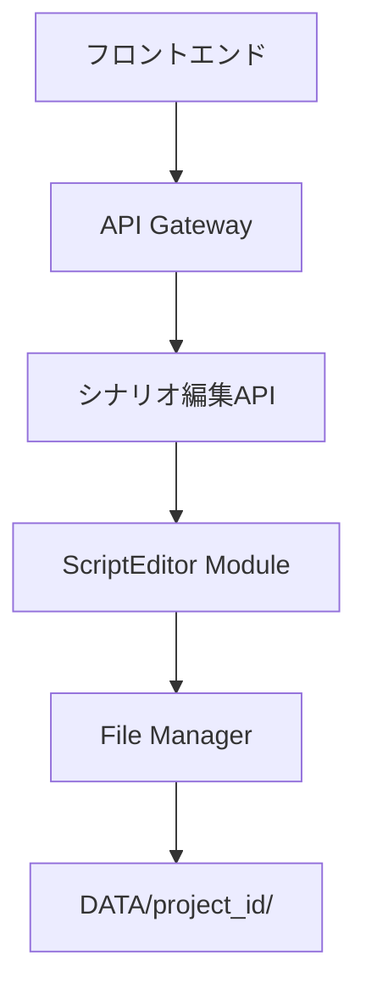

# シナリオ編集機能 - 詳細設計書（シンプル版）

## 1. 機能概要

### 1.1 目的
- 自動生成されたシナリオ（`script.yaml`）をユーザーが編集できる機能
- シンプルで直感的な編集インターフェース
- 各シーンのテキスト編集と音声設定調整

### 1.2 機能範囲
- **シーン一覧表示**: 全シーンの一覧表示
- **テキスト編集**: 各シーンの台詞・説明文の編集
- **音声設定調整**: 感情・速度・ピッチ等の音声パラメータ調整
- **シーン管理**: シーンの追加・削除・順序変更

## 2. システムアーキテクチャ

### 2.1 全体構成


### 2.2 データフロー
```
1. シナリオ生成完了
   ↓
2. 編集モード開始
   ↓
3. シーン一覧表示
   ↓
4. 個別編集
   ↓
5. 保存・次段階へ
```

## 3. データモデル

### 3.1 編集用スクリプトモデル
```typescript
interface EditableScript {
  metadata: {
    project_id: string;
    title: string;
    scenario_type: string;
    total_duration: number;
    version: number;
    edited: boolean;
    last_edited: string;
  };
  
  scenes: EditableScene[];
}

interface EditableScene {
  scene_id: number;
  scene_type: 'opening' | 'main_content' | 'explanation' | 'demonstration' | 'conclusion' | 'cta';
  duration: number;
  text: string;
  voice_settings: VoiceSettings;
  is_edited: boolean;
}

interface VoiceSettings {
  emotion: 'cheerful' | 'confident' | 'calm' | 'excited' | 'serious';
  speed: number;  // 0.5 - 2.0
  pitch: number;  // 0.5 - 2.0
  volume: number; // 0.0 - 2.0
  pause_length: number; // 0.0 - 2.0
}
```

### 3.2 API レスポンスモデル
```typescript
interface ScriptEditResponse {
  success: boolean;
  script?: EditableScript;
  message?: string;
}

interface SceneUpdateResponse {
  success: boolean;
  scene?: EditableScene;
  message?: string;
}
```

## 4. API仕様

### 4.1 エンドポイント一覧

| メソッド | エンドポイント | 説明 |
|---------|---------------|------|
| GET | `/api/script/{project_id}` | シナリオ取得 |
| PUT | `/api/script/{project_id}` | シナリオ更新 |
| PUT | `/api/script/{project_id}/scene/{scene_id}` | シーン更新 |
| POST | `/api/script/{project_id}/scene` | シーン追加 |
| DELETE | `/api/script/{project_id}/scene/{scene_id}` | シーン削除 |
| PUT | `/api/script/{project_id}/scenes/reorder` | シーン順序変更 |

### 4.2 リクエスト/レスポンス例

#### シナリオ取得
```json
// GET /api/script/550e8400-e29b-41d4-a716-446655440000
{
  "success": true,
  "script": {
    "metadata": {
      "project_id": "550e8400-e29b-41d4-a716-446655440000",
      "title": "製品紹介動画",
      "scenario_type": "product_introduction",
      "total_duration": 60,
      "version": 1,
      "edited": false,
      "last_edited": "2024-01-01T12:00:00Z"
    },
    "scenes": [
      {
        "scene_id": 1,
        "scene_type": "opening",
        "duration": 5.0,
        "text": "こんにちは！今日は素晴らしい製品をご紹介します",
        "voice_settings": {
          "emotion": "cheerful",
          "speed": 1.0,
          "pitch": 1.0,
          "volume": 1.0,
          "pause_length": 0.8
        },
        "is_edited": false
      }
    ]
  }
}
```

#### シーン更新
```json
// PUT /api/script/550e8400-e29b-41d4-a716-446655440000/scene/1
{
  "text": "こんにちは！今日は革新的な製品をご紹介します",
  "voice_settings": {
    "emotion": "excited",
    "speed": 1.1,
    "pitch": 1.05,
    "volume": 1.0,
    "pause_length": 1.0
  }
}
```

## 5. フロントエンド仕様

### 5.1 コンポーネント構成
```typescript
// ScriptEditor.tsx - メイン編集コンポーネント
interface ScriptEditorProps {
  projectId: string;
  script: EditableScript;
  onSave: (script: EditableScript) => Promise<void>;
  onNext: () => void;
  onBack: () => void;
  isLoading?: boolean;
}

// SceneList.tsx - シーン一覧コンポーネント
interface SceneListProps {
  scenes: EditableScene[];
  onSceneUpdate: (sceneId: number, updates: Partial<EditableScene>) => void;
  onSceneDelete: (sceneId: number) => void;
  onSceneAdd: () => void;
  onSceneReorder: (sceneOrder: number[]) => void;
}

// SceneItem.tsx - 個別シーンコンポーネント
interface SceneItemProps {
  scene: EditableScene;
  sceneIndex: number;
  onUpdate: (updates: Partial<EditableScene>) => void;
  onDelete: () => void;
  onEdit: () => void;
}

// SceneEditDialog.tsx - シーン編集ダイアログ
interface SceneEditDialogProps {
  scene: EditableScene;
  open: boolean;
  onClose: () => void;
  onSave: (updates: Partial<EditableScene>) => void;
}
```

### 5.2 画面レイアウト
```
┌─────────────────────────────────────────────────────────┐
│ ヘッダー: プロジェクト情報・保存ボタン・次へボタン      │
├─────────────────────────────────────────────────────────┤
│ シーン一覧パネル                                        │
│ ┌─────────────────────────────────────────────────────┐ │
│ │ シーン1: オープニング                              │ │
│ │ テキスト: "こんにちは！今日は素晴らしい..."        │ │
│ │ [編集] [削除]                                      │ │
│ ├─────────────────────────────────────────────────────┤ │
│ │ シーン2: メインコンテンツ                          │ │
│ │ テキスト: "この製品には3つの革新的な特徴..."        │ │
│ │ [編集] [削除]                                      │ │
│ ├─────────────────────────────────────────────────────┤ │
│ │ シーン3: 結論                                      │ │
│ │ テキスト: "ぜひお試しください！"                    │ │
│ │ [編集] [削除]                                      │ │
│ ├─────────────────────────────────────────────────────┤ │
│ │ [+ シーン追加]                                     │ │
│ └─────────────────────────────────────────────────────┘ │
├─────────────────────────────────────────────────────────┤
│ フッター: 戻る・保存・次へボタン                        │
└─────────────────────────────────────────────────────────┘
```

### 5.3 編集機能詳細

#### 5.3.1 シーン一覧表示
- **シーン情報**: シーン番号、タイプ、テキスト（短縮版）
- **編集ボタン**: 各シーンの編集ダイアログを開く
- **削除ボタン**: シーンの削除（確認ダイアログ付き）
- **追加ボタン**: 新しいシーンの追加

#### 5.3.2 シーン編集ダイアログ
- **テキスト編集**: フルテキストエディタ
- **音声設定**: 感情・速度・ピッチのスライダー調整
- **時間設定**: シーン時間の調整
- **シーンタイプ**: ドロップダウンで種別変更

#### 5.3.3 シーン管理
- **追加**: 新しいシーンを末尾に追加
- **削除**: 選択したシーンの削除
- **並び替え**: ドラッグ&ドロップで順序変更（オプション）

## 6. バックエンド実装

### 6.1 ScriptEditor モジュール
```python
class ScriptEditor:
    def __init__(self):
        self.file_manager = FileManager()
    
    async def get_script(self, project_id: str) -> Dict:
        """編集用シナリオを取得"""
        
    async def update_script(self, project_id: str, script_update: Dict) -> Dict:
        """シナリオを更新"""
        
    async def update_scene(self, project_id: str, scene_id: int, scene_update: Dict) -> Dict:
        """個別シーンを更新"""
        
    async def add_scene(self, project_id: str, scene_data: Dict) -> Dict:
        """新しいシーンを追加"""
        
    async def delete_scene(self, project_id: str, scene_id: int) -> Dict:
        """シーンを削除"""
        
    async def reorder_scenes(self, project_id: str, scene_order: List[int]) -> Dict:
        """シーン順序を変更"""
```

### 6.2 API エンドポイント実装
```python
@router.get("/script/{project_id}")
async def get_script(project_id: str):
    """シナリオ取得"""
    
@router.put("/script/{project_id}")
async def update_script(project_id: str, script_update: Dict):
    """シナリオ更新"""
    
@router.put("/script/{project_id}/scene/{scene_id}")
async def update_scene(project_id: str, scene_id: int, scene_update: Dict):
    """シーン更新"""
    
@router.post("/script/{project_id}/scene")
async def add_scene(project_id: str, scene_data: Dict):
    """シーン追加"""
    
@router.delete("/script/{project_id}/scene/{scene_id}")
async def delete_scene(project_id: str, scene_id: int):
    """シーン削除"""
```

## 7. データベース設計

### 7.1 シンプルなファイルベース管理
```python
# DATA/project_id/script.yaml として保存
# バックアップは script_backup.yaml として保存
```

## 8. エラーハンドリング

### 8.1 エラーコード定義
```python
SCRIPT_EDIT_ERRORS = {
    "E001": "Invalid script structure",
    "E002": "Scene not found",
    "E003": "Invalid scene data",
    "E004": "File save failed",
    "E005": "Scene reorder failed"
}
```

### 8.2 エラーレスポンス
```python
{
    "success": False,
    "error": "E001",
    "message": "Invalid script structure"
}
```

## 9. パフォーマンス最適化

### 9.1 シンプルな更新戦略
- **個別更新**: シーンごとの個別保存
- **一括更新**: 全体的な変更時の一括保存
- **自動保存**: 一定間隔での自動保存

## 10. セキュリティ

### 10.1 基本的なセキュリティ
- **入力検証**: 基本的なテキスト検証
- **ファイル権限**: プロジェクト所有者の確認
- **ログ記録**: 編集操作の記録

## 11. テスト戦略

### 11.1 単体テスト
```python
class TestScriptEditor:
    def test_get_script(self):
        """シナリオ取得テスト"""
        
    def test_update_scene(self):
        """シーン更新テスト"""
        
    def test_add_scene(self):
        """シーン追加テスト"""
        
    def test_delete_scene(self):
        """シーン削除テスト"""
```

### 11.2 統合テスト
```python
class TestScriptEditFlow:
    def test_complete_edit_flow(self):
        """完全な編集フローテスト"""
        
    def test_scene_management(self):
        """シーン管理テスト"""
```

## 12. デプロイメント

### 12.1 環境設定
```bash
# 編集機能用環境変数
SCRIPT_EDIT_ENABLED=true
MAX_EDIT_SESSIONS=50
EDIT_SESSION_TIMEOUT=3600
```

### 12.2 監視設定
```yaml
# メトリクス定義
script_edit_metrics:
  - edit_sessions_active
  - scene_updates_count
  - save_frequency
```

## 13. 実装優先順位

### 13.1 Phase 1: 基本機能
1. シーン一覧表示
2. シーン編集ダイアログ
3. 基本的なCRUD操作

### 13.2 Phase 2: 拡張機能
1. シーン順序変更
2. 音声設定詳細調整
3. バックアップ機能

### 13.3 Phase 3: 最適化
1. パフォーマンス改善
2. ユーザビリティ向上
3. エラーハンドリング強化

この設計書に基づいて、シンプルで使いやすいシナリオ編集機能を実装できます。シーン一覧のみのパネルで、各シーンにテキストと編集ボタンがある形になります。 